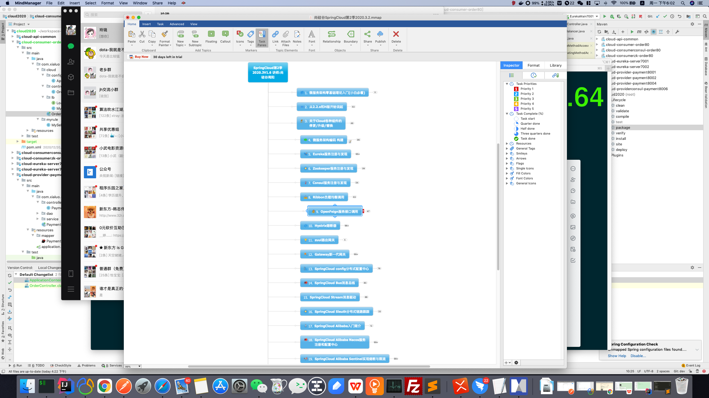

# xialuo-cloud-2020

# 5.eureka
#### 1.简介
```yaml
什么是服务注册与发现
Eureka采用了CS的设计架构，Eureka Server作为服务注册功能的服务器，它是服务注册中心。而系统中的其他微服务，使用Eureka的客户端连接到Eureka Server并维持心
跳连接。这样系统的维护人员就可以通过Eureka Server 来监控系统中各个微服务是否正常运行。
在服务注册与发现中，有一个注册中心。当服务器启动的时候，会把当前白己服务器的信息比却服务地址通讯地址等以别名方式注册到注册中心上。另-方(消费者服务提供
者)，以该别名的方式去注册中心上获取到实际的服务通讯地址，然后再实现本地RPC调用RPC远程调用框架核心设计思想:在于注册中心，因为使用注册中心管理每个服务与
服务之间的一个依赖关系(服务治理概念。在任何rpc远程框架中，都会有一个注册中心(存放服务地址相关信息(按口地址》
```
#### 2.eureka两大组件
```yaml
Eureka包含两个组件: Eureka Server和Eureka Client
Eureka Server提供服务注册服务
各个微服务节点通过配置启动后，会在EurekaServer中进行注册， 这样EurekaServer中的服务注册表中将会存储所有可用服务节点的
信息，服务节点的信息可以在界面中直观看到。

EurekaClient通过注册中心进行访问
是一个Java客户端，用于简化Eureka Server的交互,客户端同时也具备一个内置的、 使用轮询(round-robin)负载算法的负载均衡器
。在应用启动后，将会向Eureka Server发送心跳(默认周期为30秒)。如果Eureka Server在多个心跳周期内没有接收到某个节点的心
跳，EurekaServer将 会从服务注册表中把这个服务节点移除(默认90秒)
```
#### 3.erueka集群说明
```yaml
1先启动eurek注册中心
2启动服野提供者payment支付服务
3支付服务启动后会把自身信息(比如服务地以国名方式注册遊eureka)
4消费者order服务在需要调用接口时，使用服务别名去注册中心研取实际的RPC远程调用地址
5消费者获得调用地址后，底层实际是利用HtpClien技术实现远程调用
6消费者获得服努地址后会缓存在本地vm内存中，默认梅间隔30秒更新-次服务调用地址
```
#### 4。负载均衡 
```yaml
使用@LoadBalanced注解赋予RestTemplate负载均衡的能力
自带ribbon
```
#### 5.actuator微服务信息完善/访问信息有IP信息提示
```yaml
主机名称:服务名称修改
eureka:
  client:
    #表示是否将自己注册进EurekaServer默认为true。
    register-with-eureka: true
    #是否从EurekaServer抓取已有的注册信息，默认为true。单节点无所谓，集群必须设置为true才能配合ribbon使用负载均衡
    fetchRegistry: true
    service-url:
      #单机版
#      defaultZone: http://localhost:7001/eureka
#      # 集群版
  instance:
    instance-id: payment8002
    #访问路径可以显示IP地址
    prefer-ip-address: true
```
#### 6.服务发现Discovery
```java
//TODO 对于注册eureka里面的微服务,可以通过服务发现来获得该服务的信息
//TODO 启动类@EnableDiscoveryClient
@Slf4j
public class PaymentController
{
    @Resource
    private DiscoveryClient discoveryClient;

    @GetMapping(value = "/payment/discovery")
    public Object discovery()
    {
        List<String> services = discoveryClient.getServices();
        for (String element : services) {
            log.info("*****element: "+element);
            List<ServiceInstance> instances = discoveryClient.getInstances(element);
            for (ServiceInstance instance : instances) {
                log.info(instance.getServiceId()+"\t"+instance.getHost()+"\t"+instance.getPort()+"\t"+instance.getUri());
            }
        }
        return this.discoveryClient;
    }
}
```
#### 7.eureka自我保护：属于CAP里面的AP分支
```yaml
自我保护机制:默认情况下EurekaClent定时向EurekaServer端发送心跳包
如果Eureka在server端在一定时间内(默认90秒没有收到EurekaClent发送心跳包， 便会
直接从服务注册列表中剔除该服务。但是在规时间(90秒中)内丢失了大量的服务实例心跳。
这时候EurekaServer会开启自我保护机制，不会国该服务(读现象可能出现在如果网络不通
但是EurekaClent为出现老机此时如果换做别的注册中心如果一 定时间内没有收到心既会将
副附该服务,这样就出现了严重失误，因为喜户端还能正常发送心跳.只是网络延迟问题。而
保护机制是为了解决此问题而产生的)
```

# 6.zookeeper:SpringCloud整合Zookeeper替代Eureka
#### 1.pom
```xml
<dependency>
    <groupId>org.springframework.cloud</groupId>
    <artifactId>spring-cloud-starter-zookeeper-discovery</artifactId>
    <!--先排除自带的zookeeper3.5.3-->
    <exclusions>
        <exclusion>
            <groupId>org.apache.zookeeper</groupId>
            <artifactId>zookeeper</artifactId>
        </exclusion>
    </exclusions>
</dependency>
<!--添加zookeeper3.4.9版本-->
<dependency>
    <groupId>org.apache.zookeeper</groupId>
    <artifactId>zookeeper</artifactId>
    <version>3.4.9</version>
</dependency>
```

#### 2.
```yaml
#服务别名----注册zookeeper到注册中心名称
spring:
  application:
    name: cloud-provider-payment
  cloud:
    zookeeper:
      connect-string: 59.110.213.162:2181
```

### 3.服务节点是临时节点还是持久节点 :临时节点

# 7.consul
#### 1.简介
```yaml
1 是什么：Consul是一 套开源的分布式服务发现和配置管理系统，由HashiCorp公司用Go语言开发。
2 提供了微服务系统中的服务治理、配中心、控制总线等功能。这些功能中的每一个都可以根据需要单独使用，也可以-起使用以构建全方位的服
务网格，总之Consul提供了-种完整的服务网格解决方案。
```
#### 2.下载地址：https://www.consul.io/downloads.html
#### 3.使用开发模式启动:consul agent -dev 通过以下地址可以访问Consul的首页: http://localhost:8500
#### 4.pom
```xml
<dependency>
    <groupId>org.springframework.cloud</groupId>
    <artifactId>spring-cloud-starter-consul-discovery</artifactId>
</dependency>
```
```yaml
spring:
  application:
    name: consul-provider-payment
####consul注册中心地址
  cloud:
    consul:
      host: localhost
      port: 8500
      discovery:
        hostname: 127.0.0.1
        service-name: ${spring.application.name}
```

# 三个注册中心异同点
```yaml
eureka java语言 AP 支持健康检查 对外暴露http接口
consul go语言   CP 支持健康检查 对外暴露http接口
zk     java语言 CP 支持健康检查 客户端形式
```

# 8.ribbon 
#### 1是什么: Ribbon其实就是一个软负载均衡的客户端组件,  他可以和其他所需请求的客户端结合使用,和eureka结合只是其中一个实例.
#### 2底层 @LoadBalanced+RestTemplate
#### 3postForObject/postEntity
返回对象为ResponseEntity对象，包含了响应中的一些重要信息，比如响应头、响应状态码、响应体等
#### 4Ribbon核心组件IRule:IRule:根据特定算法从服务列表中选取一个要访问的服务
```yaml
com.netflix.loadbalancer.RoundRobinRule  轮询
com.netflix.loadbalancer.RandomRule  随机
com.netflix.loadbalancer.RetryRule
  先按照RoundRobinRule的策略获取服务,如果获取服务失败则在指定时间内进行重试,获取可用的服务
WeightedResponseTimeRule
  对RoundRobinRule的扩展,响应速度越快的实例选择权重越多大,越容易被选择
BestAvailableRule
  会先过滤掉由于多次访问故障而处于断路器跳闸状态的服务,然后选择一个并发量最小的服务
AvailabilityFilteringRule
  先过滤掉故障实例,再选择并发较小的实例
ZoneAvoidanceRule
  默认规则,复合判断server所在区域的性能和server的可用性选择服务器
```
#### 5.如何替换
```java
官方文档明确给出了警告:
这个自定义配置类不能放在@ComponentScan所扫描的当前包下以及子包下，
否则我们自定义的这个配置类就会被所有的Ribbon客户端所共享,达不到特殊化定制的目的了。
主启动：@RibbonClient(name = "CLOUD-PAYMENT-SERVICE", configuration = MySelfRule.class) 

@Configuration
public class MySelfRule
{
    @Bean
    public IRule myRule()
    {
        return new RandomRule();//定义为随机
    }
}
```
#### 6.负载均衡算法: rest接口第几次请求数%服务器集群总数量=实际调用服务器位置下标，每次服务 重启动后rest接口计数从1开始。

# 9.openfeign
#### 1.是什么：Feign是一个声明式的Web服务客户端,让编写Web服务客户端变得非常容易,只需  创建一个接口并在接口上添加注解即可
#### 2。主启动@EnableFeignClients
#### 3。业务类@FeignClient
#### 4。Feign自带负载均衡配置项 底层就是ribbon
#### 5。OpenFeign超时控制 OpenFeign默认等待1秒钟,超过后报错
```yaml
ribbon:
#指的是建立连接所用的时间，适用于网络状况正常的情况下,两端连接所用的时间
  ReadTimeout: 5000
#指的是建立连接后从服务器读取到可用资源所用的时间
  ConnectTimeout: 5000
```
#### 6。OpenFeign日志打印功能
```java
@Configuration
public class FeignConfig
{
    @Bean
    Logger.Level feignLoggerLevel()
    {
        return Logger.Level.FULL;
    }
}
```
```yaml
logging:
  level:
    # feign日志以什么级别监控哪个接口
    com.xialuo.cloud.service: debug
```

# 10.hystrix
#### 1。是什么
```html
Hystrix是一个用于处理分布式系统的延迟和容错的开源库， 在分布式系统里,许多依赖不可避免的会调用失败,比如超时、异常等,
Hystrix能够保证在一个依赖出问题的情况下,`不会导致整体服务失败，避免级联故障，以提高分布式系统的弹性。`

“断路器"本身是一种开关装置, 当某个服务单元发生故障之后,通过断路器的故障监控(类似熔断保险丝) .向调用方返回一个符合
预期的、可处理的备选响应(FallBack) .而不是长时间的等待或者抛出调用方无法处理的异常，这样就保证了服务调用方的线程不会
被长时间、不必要地占用，从而避免了故障在分布式系统中的蔓延，乃至雪崩。
```

#### 2。能干嘛
- 服务降级
- 服务熔断
- 接近实时的监控

#### 3.HyStrix重要概念
```html
服务降级
  服务器忙,请稍后再试,不让客户端等待并立刻返回一个友好提示,fallback
  哪些情况会发出降级
    程序运行异常
    超时
    服务熔断触发服务降级
    线程池/信号量也会导致服务降级
服务熔断
  类比保险丝达到最大服务访问后,直接拒绝访问,拉闸限电,然后调用服务降级的方法并返回友好提示
  就是保险丝
    服务的降级->进而熔断->恢复调用链路
服务限流
  秒杀高并发等操作,严禁一窝蜂的过来拥挤,大家排队,一秒钟N个,有序进行
```

#### 4.HyStrix解决的问题
```html
如何解决?解决的要求
  超时导致服务器变慢(转圈)
    超时不再等待
  出错(宕机或程序运行出错)
    出错要有兜底
  解决
    对方服务(8001)超时了,调用者(80)不能一直卡死等待,必须有服务降级
    对方服务(8001)down机了,调用者(80)不能一直卡死等待,必须有服务降级
    对方服务(8001)ok,调用者(80)自己有故障或有自我要求(自己的等待时间小于服务提供者)
```

#### 5。服务降级
##### 5.1。案例
```java
@RestController
@Slf4j
public class OrderHystirxController
{
/**
  * 描述: 上图故意制造两个异常: .
        1 int age = 10/0;计算异常
        2我们能接受1.5秒钟,它运行5秒钟，超时异常。
        当前服务不可用了，做服务降级，兜底的方案都是paymentTimeOutFallbackMethod.
  **/
    @GetMapping("/consumer/payment/hystrix/timeout/{id}")
    @HystrixCommand(fallbackMethod = "paymentTimeOutFallbackMethod",commandProperties = {
            @HystrixProperty(name="execution.isolation.thread.timeoutInMilliseconds",value="1500")
    })
    public String paymentInfo_TimeOut(@PathVariable("id") Integer id)
    {
//        int age = 10/0;
        String result = paymentHystrixService.paymentInfo_TimeOut(id);//会运行5秒
        return result;
    }
    public String paymentTimeOutFallbackMethod(@PathVariable("id") Integer id)
    {
        return "我是消费者80,对方支付系统繁忙请10秒钟后再试或者自己运行出错请检查自己,o(╥﹏╥)o";
    }
}
```
##### 5.2。 主启动 @EnableHystrix    
##### 5.3。 YML   
```yaml
feign:
  
  hystrix:
    
    enabled: true 
```       
##### 5.4.目前问题---->每个业务方法对应一个兜底的方法,代码膨胀,统一和自定义的分开
```java
@RestController
@Slf4j
@DefaultProperties(defaultFallback = "payment_Global_FallbackMethod")
public class OrderHystirxController
{
    @Resource
    private PaymentHystrixService paymentHystrixService;

    /**
     * 描述:
     * 模拟如果调feign 8001宕机 返回 feign的fallback
     * 如果8001正常，但是超过我允许的1500毫秒 走80的全局fallback
     **/
    @GetMapping("/consumer/payment/hystrix/timeout/{id}")
    @HystrixCommand(commandProperties = {
        @HystrixProperty(name="execution.isolation.thread.timeoutInMilliseconds",value="1500")
    })
    public String paymentInfo_TimeOut(@PathVariable("id") Integer id)
    {
//        int age = 10/0;
        String result = paymentHystrixService.paymentInfo_TimeOut(id);
        return result;
    }

    // 下面是全局fallback方法
    public String payment_Global_FallbackMethod()
    {
        return "Global异常处理信息，请稍后再试，/(ㄒoㄒ)/~~";
    }
}
```
```java
@Component
@FeignClient(value = "CLOUD-PROVIDER-HYSTRIX-PAYMENT" ,fallback = PaymentFallbackService.class)
public interface PaymentHystrixService
{
    @GetMapping("/payment/hystrix/timeout/{id}")
    public String paymentInfo_TimeOut(@PathVariable("id") Integer id);
}
```
```java
@Component
public class PaymentFallbackService implements PaymentHystrixService
{
    @Override
    public String paymentInfo_TimeOut(Integer id)
    {
        return "-----PaymentFallbackService fall back-paymentInfo_TimeOut ,o(╥﹏╥)o";
    }
}
```

#### 6.服务熔断
##### 6.1。是什么
```html
熔断机制概述
熔断机制是应对零崩效应的一种微服务链路保护机制。 当扇出链路的某个微服务出错不可用或者响应时间太长时，
会进行服务的降级，进而熔断该节点微服务的调用，快速返回错误的响应信息。
当检测到该节点微服务调用响应正常后，恢复调用链路。
在Spring Cloud框架里，熔断机制通过Hystrix实现. Hystrix会监控微服务间调用的状况，
当失败的调用到一-定阈值，缺省是5秒内20次调用失败,就会启动熔断机制。熔断机制的注解是@HystrixCommand.
```

#### 6.2。案例
```java
@RestController
@Slf4j
public class PaymentController
{
 //=====服务熔断
    /**
     * 描述: 默认5秒内20次
     * 这个配置的意思是 时间窗口10秒中内，请求必须10次以上 如果小于10次 不会处罚熔断；
     * 大于10次以上请求，并且错误率在60%以上 会熔断；
     *
     * 当断路器打开，对主逻辑进行熔断之后，hystrix会启动一个休眠时间窗10秒, 在这个时间窗内，降级逻辑是临时的成为主逻辑,
     * 当休眠时间窗到期，断路器将进入半开状态,释放-次请求到原来的主逻辑上，如果此次请求正常返回,那么断路器将继续闭合,
     * 主逻辑恢复，如果这次请求依然有问题，断路器继续进入打开状态,休眠时间窗重新计时。
     *
     **/
    @HystrixCommand(fallbackMethod = "paymentCircuitBreaker_fallback",commandProperties = {
            @HystrixProperty(name = "circuitBreaker.enabled",value = "true"),// 是否开启断路器
            @HystrixProperty(name = "circuitBreaker.requestVolumeThreshold",value = "10"),// 请求次数
            @HystrixProperty(name = "circuitBreaker.sleepWindowInMilliseconds",value = "10000"), // 时间窗口期
            @HystrixProperty(name = "circuitBreaker.errorThresholdPercentage",value = "60"),// 失败率达到多少后跳闸 60%
    })
    public String paymentCircuitBreaker(@PathVariable("id") Integer id)
    {
        if(id < 0)
        {
            throw new RuntimeException("******id 不能负数");
        }
        String serialNumber = IdUtil.simpleUUID();

        return Thread.currentThread().getName()+"\t"+"调用成功，流水号: " + serialNumber;
    }
    public String paymentCircuitBreaker_fallback(@PathVariable("id") Integer id)
    {
        return "id 不能负数，请稍后再试，/(ㄒoㄒ)/~~   id: " +id;
    }
}
```

#### 6.3。熔断类型
```html
熔断打开
   请求不再调用当前服务,内部设置一般为MTTR(平均故障处理时间),当打开长达导所设时钟则进入半熔断状态
 熔断关闭
   熔断关闭后不会对服务进行熔断
 熔断半开
   部分请求根据规则调用当前服务,如果请求成功且符合规则则认为当前服务恢复正常,关闭熔断
```

#### 6.4.涉及到断路器的三个重要参数:快照时间窗、请求总数阀值、错误百分比阀值。
```html
1:快照时间窗:断路器确定是否打开需要统计-些请求和错误数据，而统计的时间范围就是快照时间窗，默认为最近的10秒。
2:请求总数阀值:在快照时间窗内，必须满足请求总数阀值才有资格熔断。默认为20,意味着在10秒内，如果该hystrix命令的调用次数不足20次，
即使所有的请求都超时或其他原因失败，断路器都不会打开。
3:错误百分比阀值:当请求总数在快照时间窗内超过了阀值，比如发生了30次调用，如果在这30次调用中,有15次发生了超时异常，也就是超过
50%的惜误百分比，在默认设定50%阀值情况下，这时候就会将断路器打开。
```

#### 6.5.服务监控hystrix-Dashboard
```html
除了隔离依赖服务的调用以外，Hystrix还提供 了准实时的调用监控(Hystrix Dashboard) , Hystrix会持续地记录所有通过Hystrix发
起的请求的执行信息，并以统计报表和图形的形式展示给用户，包括每秒执行多少请求多少成功，多少失败等。Netflix通过
hystrix- metrics-event-stream项目实现了对以上指标的监控。Spring Cloud也提供了Hystrix Dashboard的整合，对监控内容转化成
可视化界面。
```
```xml
<dependency>
    <groupId>org.springframework.cloud</groupId>
    <artifactId>spring-cloud-starter-netflix-hystrix-dashboard</artifactId>
</dependency>
```
> 具体参考项目中的文档 《尚硅谷SpringCloud第2季2020.3.2.mmap》

# 11。gateway

